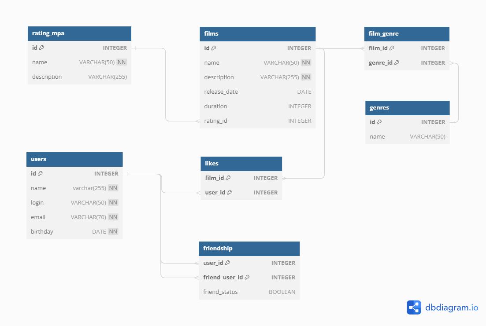

# java-filmorate

## DataBase-ER-Diagram



## Примеры SQL-запросов
Получить фильм по id:
```roomsql
SELECT *
FROM film 
WHERE film_id = 1;
```
Получить все названия фильмов, рейтинг которых R:
```roomsql
SELECT f.name
FROM film AS f
LEFT JOIN film_rating AS fr ON fr.film_id = f.film_id
LEFT JOIN rating AS r ON fr.rating_id = r.rating_id
WHERE r.name = 'R';
```
Получить фильмы жанр которых "Боевик":
```roomsql
SELECT f.name
FROM film AS f
LEFT JOIN genre_films AS gf ON gf.film_id = f.film_id
LEFT JOIN genre AS g ON gf.genre_id=g.genre_id
WHERE g.name = 'Боевик';
```
Получить id подтвержденных друзей пользователя c id = 1:
```roomsql
SELECT f.name, fr.friend_user_id
FROM film AS f
LEFT JOIN friendship AS fr ON fr.user_id=f.user_id
LEFT JOIN friend_status AS fs ON fs.friend_status_id=fr.friend_status_id
WHERE fs.status = 'confirmed';
```